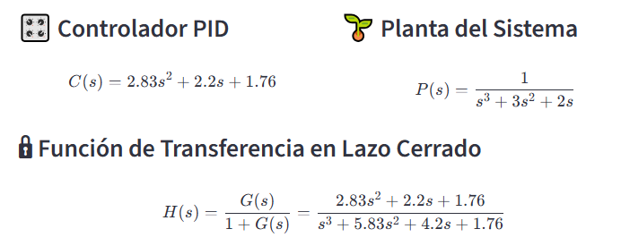
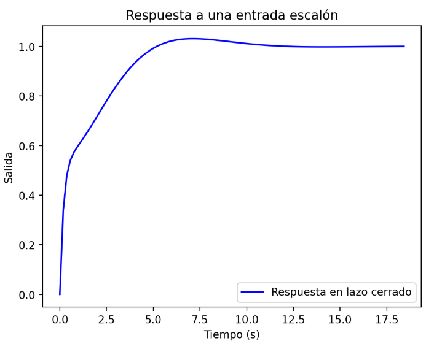
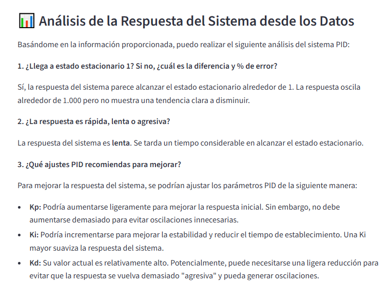

# 🖼️ Visualización del Proyecto PID + IA

## 🔢 1. Parámetros del PID

---

## 📊 2. Configuración del Controlador y la Planta

---

## 📈 3. Respuesta del Sistema Simulado

---

## 🤖 4. Análisis Generado por Inteligencia Artificial

